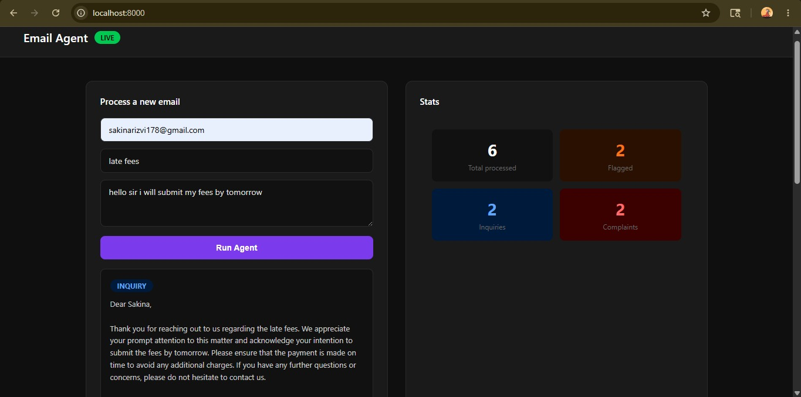

# AI Email Automation Agent

An intelligent email processing agent built with LangChain, FastAPI, and MongoDB. 
Automatically classifies incoming emails, drafts professional replies, flags complaints, and logs everything to a database.

## Demo

## Features
- Classifies emails into: inquiry, complaint, spam, other
- Auto-drafts professional replies using LLaMA 3 via Groq
- Flags complaints for human review
- Stores all results in MongoDB
- Clean web UI to process and view emails

## Tech Stack
- Python, FastAPI, LangChain, MongoDB, Groq API

## Setup
1. Clone the repo
2. Create a virtual environment: `python -m venv venv`
3. Install dependencies: `pip install langchain langchain-groq pymongo python-dotenv fastapi uvicorn`
4. Copy `.env.example` to `.env` and add your keys
5. Start MongoDB
6. Run: `uvicorn api:app --reload`
7. Open: `http://localhost:8000`"# email_agent" 
